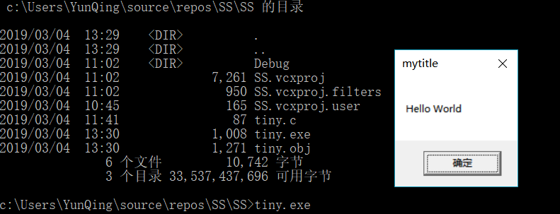

## 作业1

### 编写一个release版本的 hello world 程序。通过修改程序可执行文件的方式（不是修改源代码），使得程序运行后显示的内容不为hello world，变成 hello cuc！

提示：一定要在编译选项中将调试信息相关的编译连接选项去掉，否则程序体积会比较大，而且存在很多“干扰”信息。

#### 实验环境

vs2017

WinHex19.8

####  操作步骤

编写tiny.c，文件内容如下：

```c++
#include<stdio.h>
int main() {
	MessageBoxA(NULL, "Hello World", "mytitle", NULL);
}
```

在命令行执行以下命令

```bash
cl /c /O1 tiny.c
link user32.lib /nologo /ENTRY:main /NODEFAULTLIB /SUBSYSTEM:WINDOWS /ALIGN:16 tiny.obj
```

使用dir命令查看目录
​	
运行tiny.exe
​	
使用winhex工具搜索字符串位置，将 World 改为CUC！并保存
​	
再次运行tiny.exe，更改成功
​	

## 作业 2

### 上一题的程序中，修改的显示内容变为一个很长的字符串（至少2kb长）。并且保证程序正常运行不崩溃。

提示，可执行文件中原有的空间有限，必须要新加入数据，加入数据后必须要修改.text字段中的指针。

### 实验步骤

- 首先编写一个exe文件，运行效果如下

  

- 执行命令`dumpin /disasm tiny.exe` 查看反汇编代码，红框处为传入字符串参数的地址

  

  查看二进制PE文件中参数的地址发现正好是传入的字符串

  

- 找到代码段，准备修改参数指针!

  

  多次尝试后发现偏移地址影响的是[ 0000000140000298h]中，除去最末两位的6位数字，也就是400002这几位，我的exe文件大小为1088（440h）k，因此做如下修改,将字符串地址从298h改为498h

  

  同时在exe文件末尾填充字节,(从498h填充到c98h刚好是800h,2k的大小)

  

- 查看反汇编代码验证参数地址已更改

  

- 再次运行 tiny.exe 效果

  

## 作业 3
### 在notepad（32位64位均可）中，输入一段文字。然后使用调试器，在内存中修改这段文字。使得没有在界面操作notepad的修改文字的情况下。notepad中显示的文字变化。

提示，在调试器中定位控件缓存的内存地址，可以用搜索、逆向、消息截获分析、API截获分析等方法。

---
- 打开notepad，输入文字 hello from cloud

- 打开windbg x64，选择File > Attach To a Process，选择notepad.exe

  ```
  !heap -a # 查看所有堆
  s -u 要查找的段的起始地址和结束地址 "要匹配的字符串"  # 查找字符串
  du 地址 # Unicode显示字符串
  ezu 地址 "更改的字符串" # 更改字符串
  ```
  

- 结果演示
  

# 4、通过调试器监控计算器程序的运行，每当运行结果为666时，就改为999。

提示：找到运行结果在内存中保存的地址。监控 “=” 按键消息等。

- 

# 5、通过API hook的方法，在每次notepad保存txt文件时，就将文件内容修改为： “you have been hacked!”

- CloseFile函数
- 文件指针调到文件头重新写入，再closefile
- 或者在保存的时候写入
- IAT Hook