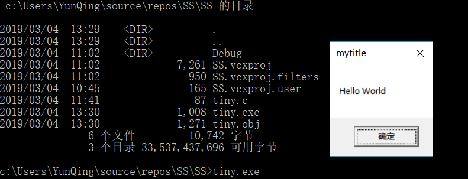
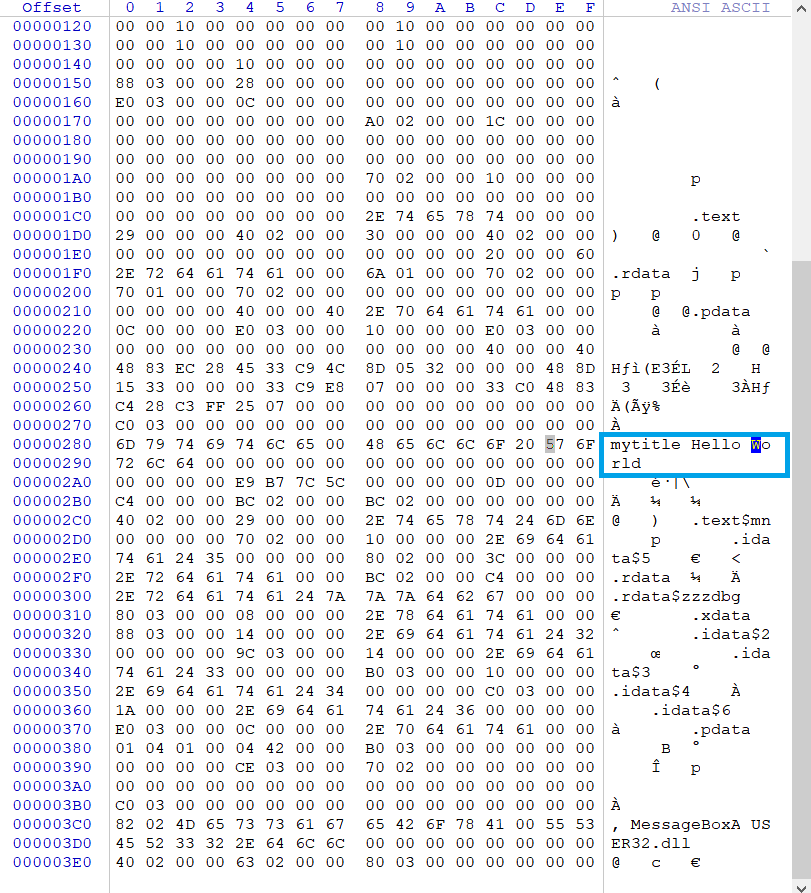
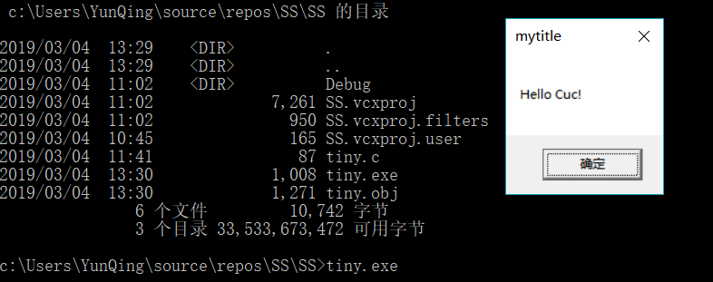

## 作业1

### 编写一个release版本的 hello world 程序。通过修改程序可执行文件的方式（不是修改源代码），使得程序运行后显示的内容不为hello world，变成 hello cuc！

提示：一定要在编译选项中将调试信息相关的编译连接选项去掉，否则程序体积会比较大，而且存在很多“干扰”信息。

#### 实验环境

- 主机: win10

- vs2017

- WinHex19.8

#### 操作步骤

编写tiny.c，文件内容如下：

```c++
#include<stdio.h>
int main() {
	MessageBoxA(NULL, "Hello World", "mytitle", NULL);
}
```

在命令行执行以下命令

```bash
cl /c /O1 tiny.c
link user32.lib /nologo /ENTRY:main /NODEFAULTLIB /SUBSYSTEM:WINDOWS /ALIGN:16 tiny.obj
```

使用dir命令查看目录
​	
运行tiny.exe
​	
使用winhex工具搜索字符串位置，将 World 改为CUC！并保存
​	
再次运行tiny.exe，更改成功
​	