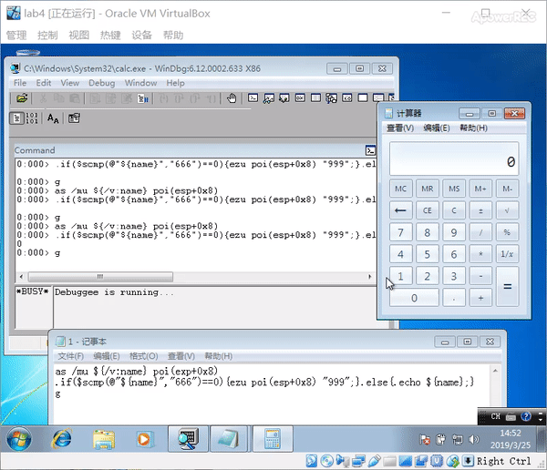

## 4、通过调试器监控计算器程序的运行，每当运行结果为666时，就改为999。

提示：找到运行结果在内存中保存的地址。监控 “=” 按键消息等。

## 实验环境

- 虚拟机：windows 7 专业版 32位
- windbg x86

## 实验步骤

- 设置windbg符号表

  - 打开 FIle > Symbol File Path 添加符号表路径`cache*c:\MySymbols;srv*https://msdl.microsoft.com/download/symbols ` ,并勾选 Reload
  - 命令行强制加载符号表 `.load /f /i`  耗时较久 


- FIle > Attach to a Process  ,打开calc.exe

- 编写脚本，内容如下，存储在c:\1.txt 

  ```
  #新定义一个别名为name 将 poi（esp+0x8）处的 unicode字符串取出
  as /mu ${/v:name} poi(esp+0x8)  
  
  #进行字符串比较 如果name和666相同 就改为 999 否则输出name
  .if($scmp(@"${name}","666")==0){ezu poi(esp+0x8) "999";}.else{.echo ${name};}
  
  #程序继续运行
  g
  ```
- 在windbg输入指令 `bp SetWindowTextW "$<C:\\1.txt"` 然后输入`g`执行
- 效果图

  

## 参考

- [jackcily/SoftSecurity_job](https://github.com/jackcily/SoftSecurity_job/blob/master/job4.md)