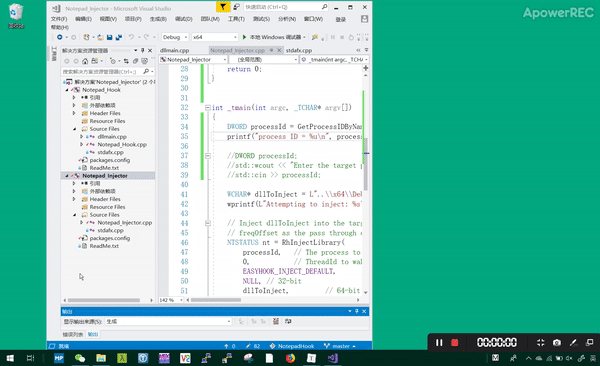
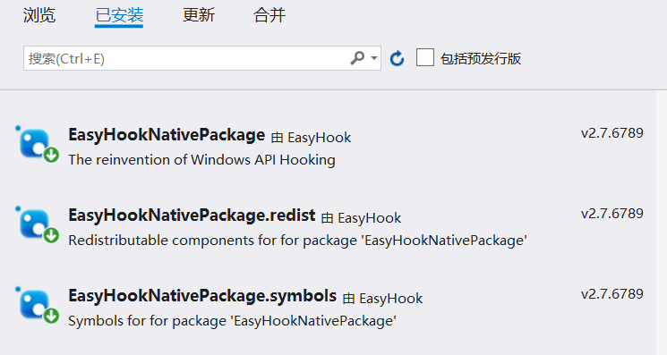

##  5、通过API hook的方法，在每次notepad保存txt文件时，就将文件内容修改为： “you have been hacked!”

API hook 的关键是编写一个假函数，用假函数的指针替换IAT中真函数的指针（当然这种方式只能对通过IAT调用的管用，但是够了。在假函数调用真函数，修改真函数的参数和返回的数据，将修改后的数据返回给调用者。

## 实验环境

win10 

vs2017 

## 实验步骤

实验完成分为两个步骤，由于我使用了[EasyHook](https://github.com/EasyHook/EasyHook)的库，所以注入dll过程和IAThook的步骤都只需要一个函数调用就可以。 我去解读了 [iathook](https://github.com/tinysec/iathook)和[InjectCode](https://github.com/EvilKnight1986/InjectCode)了解了基本原理，但在实现的时候还是有一些困难。之后找时间再把这两个库的代码用起来。

#### 1. 向目标进程注入dll

首先根据进程名称找到进程ID

使用 RhInjectLibrary 函数把 dll 注入到该目标进程中

#### 2. 编写dll实现期望的攻击效果

在本次实验中，期望在保存文件时修改文件内容，因此对WriteFile函数进行重写。

假函数的[函数原型](https://docs.microsoft.com/zh-cn/windows/desktop/api/fileapi/nf-fileapi-writefile)与官网上保持一致，在函数内部修改lpBuffer的内容，然后用修改后的参数再次调用WriteFile函数

```cpp
BOOL WriteFile(
  HANDLE       hFile,
  LPCVOID      lpBuffer,
  DWORD        nNumberOfBytesToWrite,
  LPDWORD      lpNumberOfBytesWritten,
  LPOVERLAPPED lpOverlapped
);
```

#### 最终效果



## 问题

EasyHook需要安装一下几个,

工具>NuGet包管理器>程序包管理器控制台



## 参考

- [TheMasterOfMagic](https://github.com/TheMasterOfMagic/SecurityOfSoftwareAndSystem/tree/master/5)

- [EasyHook参考视频](<https://www.youtube.com/watch?v=ro07dEPyGmY>)

