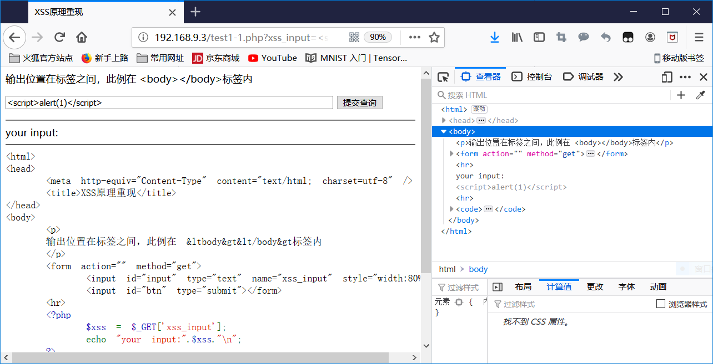
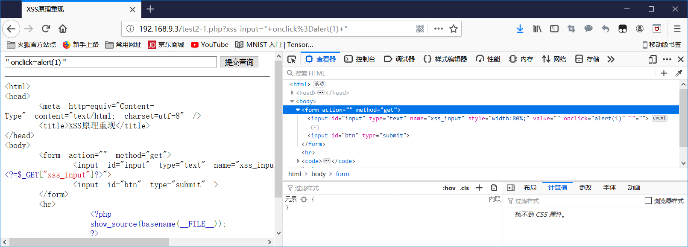
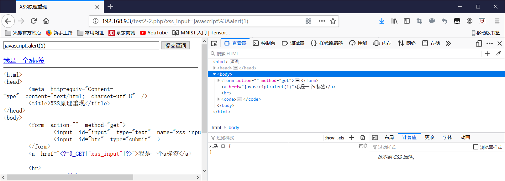

# XSS 漏洞检测

## 原理

**攻击场景**

攻击者使用网站应用发送恶意代码，通常攻击者发送服务器端脚本给另一用户，且网站应用使用了用户输入但并未对输入进行合法性验证或编码后就将其输出的情况下，易出现XSS攻击。

**客户端脚本安全**

- 攻击手段：浏览器挂马（页面中插入恶意代码）、钓鱼网站
- 防御手段：浏览器沙箱机制、定时获取网址黑名单（由特定安全厂商提供）

**浏览器同源策略**:最基本最核心的安全功能：协议、域名、端口相同。安全与可用习性的平衡。浏览器的非同源站点的3种行为收到限制

 	1. Cookie、LocalStorage、IndexDB无法读取
 	2. DOM无法获得
 	3. AJAX请求不能发送

**XSS漏洞分类**

根据漏洞成因或特征：FlashXSS,mXSS,UBBXSS,宽字节XSS等

根据攻击效果不同：反射性、存储型、DOM型

**XSS漏洞造成的常见攻击**：

- 窃取cookie和session值，挟持用户会话。（执行任意操作、身份盗用）
- 身份盗用（强制发送电子邮件）
- 网站挂马
- 网络钓鱼（用户输入重要信息泄露）
- DDOS、蠕虫攻击、跨站请求伪造

**防御规则**：对不可信输入进行编码，url编码，XSS规则引擎对富文本进行过滤

**漏洞检测**：主要要点在寻找XSS注入点与构造对应的payload上。为了能更高效检测出XSS漏洞，可根据XSS漏洞的现有的一些特征与前人积累的经验习惯构造有针对性的payload进行检测

## 基本XSS攻击场景复现

XSS攻击的方式根据具体的场景变化多样，在此复现了常见的xss攻击场景，并构造出对应的攻击脚本进行测试，

- 实验环境：
  - docker 18.09
  - docker image:tutum/lamp
    - php5.5
    - apache2.4.7

#### `<html>`标签：使用js脚本注入

----

- 一般的标签` <a> 
  <body> <button> <var> 
 <object> <input> <select> <keygen> <frameset>  <embed> <svg> <video> <audio>`

  - payload:``

    如果网站过滤了<textarea>`,需要先闭合标签

   

- js标签内：
  - 如果空格被过滤，可用/**/代替空格
  - 输出在注释中，可同通过换行逃逸
  - payload:`"; alert(1);//`,如果没过滤script标签`</script><script>`也可以

  

#### `<html>`属性：使用URL伪协议注入

---

- 在文本属性中,先闭合引号,再添加新的事件属性
  - payload:`" onclick=alert(1) "`

- 在`src/href/action/xlink:href/autofocus/content/data` 等属性中,直接用伪协议绕过

  - payload:`javascript:alert(1)`	

#### 使用htmlspecialchars过滤

---

> 可用的引号类型：
>
> - ENT_COMPAT - 默认。仅编码双引号。
> - ENT_QUOTES - 编码双引号和单引号。
> - ENT_NOQUOTES - 不编码任何引号。

  - htmlspecialchars默认配置不过滤单引号,所以外层被单引号包围是可闭合
   - payload:`' onmouseover='alert(1)`

#### 宽字节XSS
----

- 大小为2字节叫宽字节,大小为1字节叫窄字节.宽字节带来的安全问题主要是会吃一字节的ASCII字符的现象.

在php.ini中magic_quotes_gpc=On的情况下,会在双引号前加`\`,导致无法闭合双引号,此时可利用宽字节问题.需要注意的是关于魔术引号官网提示如下

> Warning 本特性已自 PHP 5.3.0 起*废弃*并将自 PHP 5.4.0 起*移除*。

- 宽字节安全问题原理:

> GBK编码第一字节（高字节）的范围为：0x81~0xFE
>
> GBK编码第二字节（低字节）的范围为：0x40~0x7E、0x80~0xFE
>
> \符号的十六进制为0x5C, 刚好处在GBK的低字节中，如果前面有一个高字节（如%c0），那么
>
> 恰好会被组合成一个合法的字符，从而\被吃掉，双引号逃逸出来。

-  payload:`%c0%22;alert(1);//`

- POC:

## XSS检测payload汇总

## 使用webdriver自动化检测

## 参考

[1] [杨君. XSS攻击检测与安全防护技术研究与设计[D].北京邮电大学,2017.](https://kns.cnki.net/KCMS/detail/detail.aspx?dbcode=CMFD&dbname=CMFD201801&filename=1017293786.nh&uid=WEEvREdxOWJmbC9oM1NjYkZCbDdrdXJJb09sNFhicTNrWDRQWDJVZThtZDE=$R1yZ0H6jyaa0en3RxVUd8df-oHi7XMMDo7mtKT6mSmEvTuk11l2gFA!!&v=Mjc3MjlkYkVxWkViUElSOGVYMUx1eFlTN0RoMVQzcVRyV00xRnJDVVJMT2ZZT2RvRnlqblVMN0lWRjI2R2JHeEg=)
[2] [XSS-wiki](https://www.owasp.org/index.php/Cross-site_Scripting_(XSS))
[2] [XSS原理&复现](<http://v0w.top/2018/08/16/XSS%E5%8E%9F%E7%90%86%E5%8F%8A%E5%A4%8D%E7%8E%B0/>)
[3]  [Python selenium 模拟浏览器](<https://blog.csdn.net/Yellow_python/article/details/80864538>)
[4] [XSS备忘录](<http://momomoxiaoxi.com/2017/10/10/XSS/>)